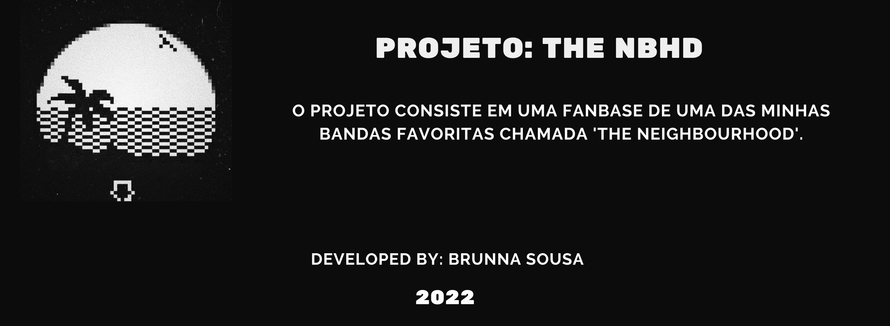

<h1 align="center">
    
</h1>

<h4 align="center"> 
	🚧 Projeto em construção... 🚧
</h4>

## 🤖 Onde encontrar ?

O Projeto está hospedado pelo GitHub Pages e você pode acessar pelo <a href="https://www.bit.ly/the-nbhd" target="_blank" rel="external">link.</a> 

- link principal: https://www.bit.ly/the-nbhd 

- link alternativo: https://brunnasousa.github.io/theNBHD_fanbase/

## 💻 Sobre o projeto

- O projeto consiste em uma Fanbase de uma das minhas bandas favoritas chamada 'The Neighbourhood'.

Possui as seguintes etapas:

    1- Header:

      - Logo + nome da banda 
      - Home
      - Spotify
      - Instagram
      - Loja

    2- main

       - part 1: Sobre a banda com informações gerais e basicas
       - part 2: Informações de cada membro da banda com link para o instagram
       - part 3: discografia da banda - Slider com informações dos 4 albuns principais.
       - part 4: link para minha playlist pessoal no spotify. Ao lado de um video do youtube oficial 'The Neighbourhood - Sweater Weather (Live)'.
       - part 5: formulario - como forma de interação inicial pedindo sugestões do usuario para uma possivel atualização futura. (inativo no momento)
       
    3- footer: minhas informações pessoais e redes sociais.

## 🛠 Ferramentas

As seguintes ferramentas foram usadas na construção do projeto até o momento:

-   [HTML](https://developer.mozilla.org/pt-BR/docs/Web/HTML)
-   [CSS](https://developer.mozilla.org/pt-BR/docs/Web/CSS)
-   [JavaScript](https://developer.mozilla.org/pt-BR/docs/Web/JavaScript)

## 🎨 Paleta de cor

- #FFFFFF; -> Para os textos
- #E2E3E4; -> Cor padrão
- #4E535D; -> Para o hover
- #212834; -> Para destacar 
- #6C7078; -> Para o botão

## 📖 Layout

O layout da aplicação está disponível no Figma:

## 📝 Autor - Contact

<table>
  <tr>
    <td align="center">
      
 

      <a href="https://www.linkedin.com/in/brunna-sousa">
         
         
          <b>Feito com ❤️ por Brunna Sousa 😄</b> 
          <b>Entre em contato.  </b>
        
      </a>
    </td>
  </tr>
</table>

## 👀 Observações Importantes

** Este projeto consiste apenas para fins de aprendizado. Os direitos autorais sobre as imagens, musicas e referencias pertencem aos seus respectivos donos.

** Inspirado no site oficial do [The Neighbourhood.](https://thenbhd.themerchcollective).

## 📢 Proximas Etapas
- clean code;
